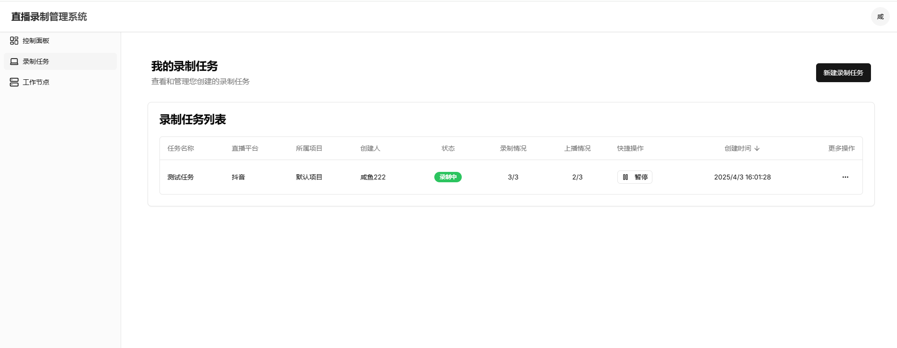
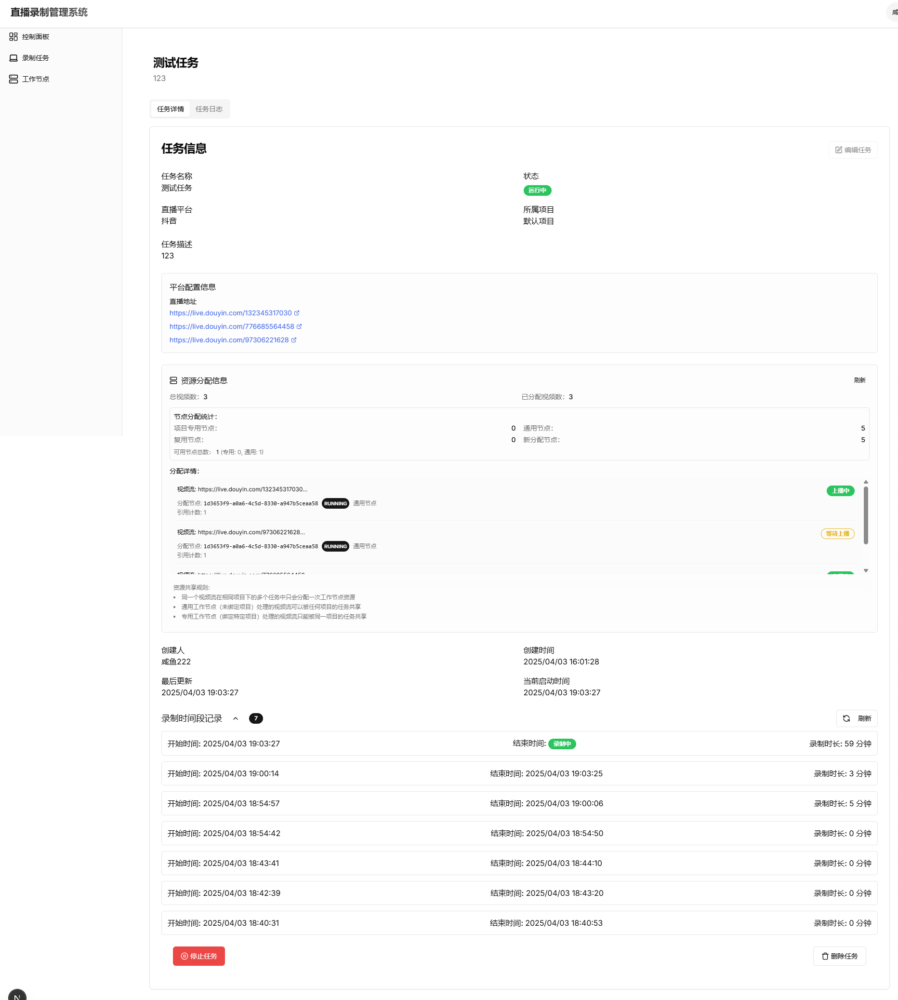
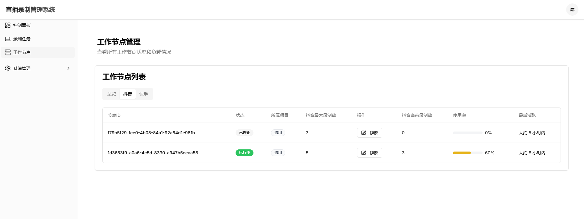
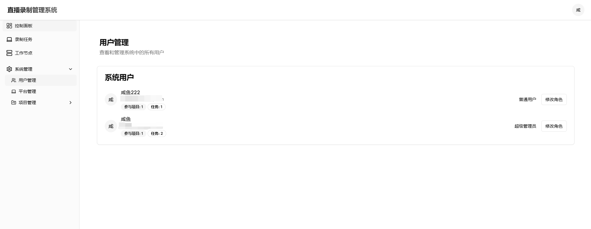
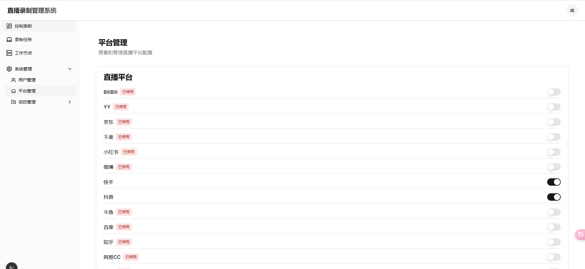
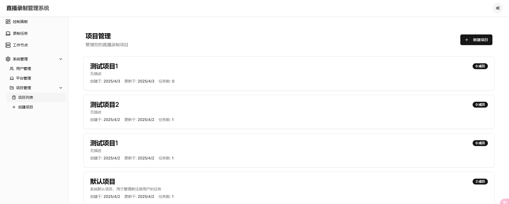

# 直播录制管理系统

> 本项目是基于 [DouyinLiveRecorder](https://github.com/ihmily/DouyinLiveRecorder) 实现的一个直播在线管理平台，提供了友好的Web界面和更丰富的管理功能。

录制任务页面



录制任务详情页面

录制节点管理



用户管理



平台管理



项目管理



## 快速开始

### 环境要求

- Node.js 18+ (建议使用最新的 LTS 版本)
- MySQL 8.0+
- 包管理器: pnpm (推荐)

### 安装步骤

1. 克隆仓库

```bash
git clone https://github.com/your-username/live-streaming-management.git
cd live-streaming-management
```

2. 安装依赖

```bash
pnpm install
```

3. 配置环境变量

创建 `.env` 文件，添加以下配置:

```
DATABASE_URL="mysql://用户名:密码@localhost:3306/live_streaming_management?schema=public&connectionTimeZone=Asia/Shanghai"
NEXTAUTH_SECRET="生成一个随机密钥" # 可以使用 openssl rand -base64 32 生成
NEXTAUTH_URL="http://localhost:3000"
```

4. 初始化数据库

```bash
# 执行数据库迁移
npx prisma migrate dev

# 初始化平台数据
pnpm setup:platforms
```

5. 启动开发服务器

```bash
pnpm dev
```

6. 访问应用

打开浏览器访问 [http://localhost:3000](http://localhost:3000)

## 项目概述

直播录制管理系统是一个专为多用户、多项目、多平台直播录制管理设计的Web应用。系统支持用户注册登录、角色权限管理、项目管理、直播平台管理以及直播录制任务的全生命周期管理。

## 核心功能

### 用户管理与认证

- **用户注册与登录**：所有用户必须注册账号并登录才能使用系统
- **默认项目分配**：新注册用户会自动分配到默认项目中
- **基于角色的权限系统**：
  - 超级管理员：拥有全系统所有权限
  - 项目管理员：拥有特定项目的所有管理权限
  - 项目成员/普通用户：拥有个人级别的有限权限，可创建录制任务

### 项目管理

- **项目创建**：超级管理员可创建新项目
- **项目权限申请**：用户可申请加入特定项目
- **项目成员管理**：项目管理员可审批用户的项目权限申请
- **项目概览**：查看项目状态、成员和任务统计
- **项目专属工作节点**：项目可以有专属的工作节点，也可使用通用工作节点

### 平台管理

- **多平台支持**：支持多种直播平台，可随时扩展添加新平台
- **平台配置管理**：管理不同平台的API密钥和配置参数
- **平台状态控制**：可启用或禁用特定平台

### 平台初始化

本系统内置了多种直播平台支持，首次使用需要初始化平台数据：

```bash
pnpm setup:platforms
```

该命令会自动创建以下平台：

1. 抖音 (https://live.douyin.com/123456789)
2. 快手 (https://live.kuaishou.com/u/yall1102)
3. 虎牙 (https://www.huya.com/52333)
4. 斗鱼 (https://www.douyu.com/3637778?dyshid=)
5. YY (https://www.yy.com/22490906/22490906)
6. BiliBili (https://live.bilibili.com/320)
7. 小红书 (https://www.xiaohongshu.com/user/profile/6330049c000000002303c7ed?appuid=5f3f478a00000000010005b3)
8. 网易CC (https://cc.163.com/583946984)
9. 微博直播 (https://weibo.com/l/wblive/p/show/1022:2321325026370190442592)
10. 酷狗直播 (https://fanxing2.kugou.com/50428671?refer=2177&sourceFrom=)
11. 知乎直播 (https://www.zhihu.com/people/ac3a467005c5d20381a82230101308e9)
12. 京东直播 (https://3.cn/28MLBy-E)
13. 花椒直播 (https://www.huajiao.com/l/345096174)
14. 百度直播 (https://live.baidu.com/m/media/pclive/pchome/live.html?room_id=9175031377&tab_category)
15. 千度热播 (https://qiandurebo.com/web/video.php?roomnumber=33333)

### 管理员功能

管理员可以在平台管理页面对各平台进行启用或禁用操作，平台名称和链接格式是固定的，不支持修改。

### 创建录制任务

创建录制任务时，可以选择平台并按照要求填写直播地址，系统会自动检查链接格式是否符合所选平台的规范。

每个平台的配置相同，需要填写：

1. 直播地址列表（一行一个地址）
2. Cookie（可选，用于需要登录才能访问的直播）**【注意：Cookie字段功能暂未实现】**

### 工作节点管理

- **工作节点状态监控**：实时监控工作节点的运行状态和负载情况
- **平台专属工作节点**：为特定平台配置专属工作节点
- **项目关联**：工作节点可关联到特定项目，也可作为通用工作节点服务于所有项目
- **自动分配**：任务启动时自动分配合适的工作节点进行录制
- **节点可见性**：
  - 超级管理员可以查看所有工作节点
  - 普通用户可以查看自己所在项目的专有节点和所有通用节点
  - 按平台筛选工作节点功能仅对超级管理员可用
- **平台特定录制容量**：超级管理员可以为每个工作节点设置各平台的最大录制容量

### 直播录制任务管理

- **任务创建**：所有用户都可创建新的直播录制任务，支持配置录制参数
- **多直播间支持**：单个任务最多可添加3个直播间地址（针对抖音平台）
- **任务控制**：支持启动、暂停、终止和删除任务
- **任务监控**：实时查看任务运行状态和日志
- **录制历史**：查看和管理历史录制内容
- **任务可见性**：
  - 超级管理员可以查看系统中的所有任务
  - 项目管理员可以查看其管理项目中的所有任务
  - 普通用户只能查看自己创建的任务
- **任务编辑权限**：
  - 超级管理员可以编辑任何任务
  - 项目管理员可以编辑所管理项目中的所有任务
  - 普通用户只能编辑自己创建的任务

### 录制记录与上播状态管理

- **录制时间段记录**：系统自动记录任务的每次启动和停止时间，提供详细的录制历史
- **记录清空功能**：任务停止状态下，管理员和任务创建者可清空历史录制记录
- **记录折叠功能**：当录制记录较多时，可折叠显示以提升界面体验
- **上播状态跟踪**：显示任务中正在上播的直播间数量与总直播间数量
- **录制状态监控**：显示当前活跃录制的直播间数量与总直播间数量
- **节点状态警告**：当工作节点异常时，系统自动显示警告信息

## 技术栈

- **前端框架**：Next.js 15（React 19）
- **UI组件库**：Radix UI + Tailwind CSS
- **认证方案**：NextAuth.js
- **数据库**：MySQL + Prisma ORM
- **状态管理**：React Hook Form + Zod

## 系统架构

系统采用现代化的前端架构，基于Next.js的App Router实现，主要模块包括：

- `/app`：应用主目录，包含所有页面和路由
  - `/admin`：管理员专属功能（用户管理、平台管理）
  - `/dashboard`：用户仪表盘，展示概览信息
  - `/login` & `/register`：用户认证页面
  - `/projects`：项目管理和详情页
    - `/projects/[id]/tasks`：特定项目的任务管理
  - `/tasks`：录制任务管理

## 菜单结构

系统菜单结构如下：

- **控制面板**：系统概览和用户仪表盘
- **录制任务**：录制任务管理
- **工作节点**：工作节点管理和状态监控（所有用户可见，但展示内容根据权限不同）
- **系统管理**（仅对超级管理员可见）：
  - 用户管理
  - 平台管理
  - 项目管理

## 使用指南

### 环境要求

- Node.js 18+
- MySQL数据库
- PNPM包管理器

### 安装步骤

1. 克隆代码库

   ```bash
   git clone [仓库地址]
   cd live-streaming-management
   ```
2. 安装依赖

   ```bash
   pnpm install
   ```
3. 配置环境变量
   创建 `.env`文件并添加必要的环境变量：

   ```
   DATABASE_URL="mysql://用户名:密码@localhost:3306/live_streaming_management?schema=public&connectionTimeZone=Asia/Shanghai"
   NEXTAUTH_SECRET="您的认证密钥"
   NEXTAUTH_URL="http://localhost:3000"
   ```
4. 运行数据库迁移

   ```bash
   npx prisma migrate dev
   ```
5. 启动开发服务器

   ```bash
   pnpm dev
   ```
6. 访问应用
   打开浏览器访问 `http://localhost:3000`

## 权限与角色说明

1. **超级管理员**

   - 创建、编辑和删除项目
   - 管理所有用户权限
   - 管理平台配置
   - 管理工作节点配置
   - 拥有系统内全部功能权限
   - 可对所有任务进行操作，即使不是项目管理员
2. **项目管理员**

   - 管理特定项目的所有方面
   - 审批用户加入项目的申请
   - 创建和管理项目内的录制任务
   - 查看项目统计和日志
3. **项目成员/普通用户**

   - 查看已加入项目的信息
   - 创建和管理个人录制任务
   - 申请加入其他项目

## 录制任务与工作节点关联关系

### 任务资源管理

系统采用了资源复用策略，为提高工作节点的利用率：

1. **直播流共享**：

   - 多个任务录制相同的直播流时，只会占用一个工作节点槽位
   - 基于引用计数机制管理资源释放
2. **工作节点分配策略**：

   - 优先使用项目专属工作节点
   - 当专属节点不足时，使用通用工作节点
   - 当存在已分配的相同直播流时，复用现有节点
3. **资源隔离**：

   - 项目专属工作节点只服务于特定项目的任务
   - 不同项目间的专属工作节点资源不共享
   - 通用工作节点可被所有项目使用

### 数据库模型关系

- **RecordingTask**：录制任务
- **LiveStream**：直播流
- **WorkerNode**：工作节点
- **TaskLivestreamAssignment**：任务与直播流的关联
- **LivestreamWorkerAssignment**：直播流与工作节点的关联，包含引用计数

### 启动与停止流程

1. **任务启动流程**：

   - 检查任务直播URL对应的LiveStream记录
   - 为LiveStream分配合适的工作节点或复用现有分配
   - 创建录制时间段记录，开始时间为当前时间，结束时间为null
   - 初始化上播状态为未知
2. **任务停止流程**：

   - 更新录制时间段记录的结束时间
   - 减少直播流与工作节点分配的引用计数
   - 当引用计数为0时，释放工作节点资源
   - 重置上播状态

## 联系作者

如有任何问题或建议，请通过以下方式联系作者：

- 邮箱：521274311@qq.com

## 许可证

本项目采用 MIT 许可证。详细许可条款请参阅项目根目录中的 LICENSE 文件。
